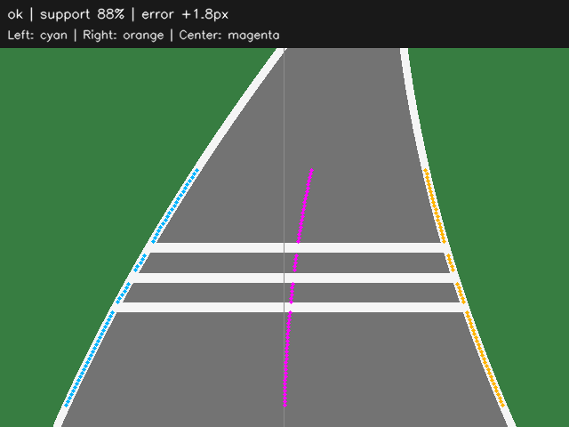

# Vision-Guided Robot Car

A reconstruction of a robot car project I built in secondary school, focusing on visual line following, PID steering, and traffic-sign recognition.

**Status:** The first perception baseline is runnable: grayscale conversion, two white-border extraction, and road-center estimation. Includes synthetic image fixtures, diagnostic overlays, and automated tests. A simulator-independent steering PID is also implemented and tested. Traffic recognition and driving simulation are planned.

## Run the Perception Demo

Requires Python 3.10 or newer. From the repository root:

```bash
python -m venv .venv
# Windows PowerShell: .venv\Scripts\Activate.ps1
# macOS / Linux: source .venv/bin/activate
python -m pip install -e ".[test]"
python -m robot_car.perception.demo --fixture crossing --output runs/crossing
python -m pytest
```

The output directory contains the input, grayscale image, threshold mask, observed lane pixels, overlay, and `result.json`. Try `--fixture straight`, `curve`, or `missing`; use `--image path/to/frame.png` for your own local camera image. Settings can be loaded with `--config configs/perception.json`.



Cyan and orange points mark observed borders; magenta points mark their midpoint. This example is a generated local image, separate from the course concept below. See [the perception guide](docs/perception.md) for the algorithm, output conventions, and limitations.

## Background

The original project used existing libraries to implement line following, PID control, and traffic-sign recognition on a physical robot car. The original source code and hardware materials are no longer available.

This repository will contain a new implementation based on that experience. It is not an archive of the original project. Features and results from the reconstruction will be documented as they are implemented and tested.

## Course Concept


AI-generated planning reference, not a calibrated map or a photograph of the original project. See [asset notes and generation prompt](assets/concepts/README.md). The simulation will generate its own local vehicle-camera views.

## Repository Structure

```text
assets/concepts/           Approved course image and provenance
configs/                   Perception settings; future control settings
docs/architecture.md       Data flow, boundaries, and development order
src/robot_car/
    perception/            Lane, crossing, light, and sign detection
    behavior/              Driving states, priorities, and timers
    control/               PID steering and speed commands
    simulation/            Vehicle model, scene, and camera rendering
    visualization/         Overlays and diagnostics
tests/                     Perception geometry, failure, and CLI tests
```

Each layer contains a README defining its responsibility. Perception, PID control, diagnostic visualization, and static image fixtures now have code. See the [architecture guide](docs/architecture.md) for interfaces and staged development.

## Planned Scope

The first version will run without physical hardware:

- **Perception:** Use OpenCV to extract a track or line from video frames and estimate lateral deviation.
- **Control:** Implement a PID controller that converts deviation into a steering command.
- **Decision logic:** Recognize a small set of traffic signs or markers and use a state machine to trigger corresponding behavior.
- **Visualization:** Show detection overlays, current state, error, and steering output.
- **Simulation:** Connect the controller to a simple vehicle simulation to evaluate closed-loop behavior.

Video processing alone will demonstrate perception and command generation; closed-loop tracking claims will require simulation or physical-vehicle testing.

## Planned Workflow

```text
Camera frame / recorded video / simulated view
                    |
         Line and sign detection
                    |
         Deviation + behavior state
                    |
               PID controller
                    |
             Steering command
                    |
        Vehicle simulation (planned)
                    |
          Updated simulated view
```

## Roadmap

- [x] Initialize the repository and document the reconstruction scope.
- [x] Add the course concept and define implementation layers.
- [x] Select reusable libraries and appropriately licensed input materials.
- [x] Build a reproducible line-following perception demo.
- [x] Implement and test the PID controller (initial gains only; closed-loop tuning pending).
- [ ] Integrate a simple vehicle simulation and evaluate tracking behavior.
- [ ] Add crossing, traffic-light, and sign recognition, then a behavior state machine.
- [ ] Publish setup instructions, a demonstration, and measured results.

## Attribution

This reconstruction uses OpenCV and NumPy. The lane-pairing algorithm and synthetic fixtures are newly written for this repository; no third-party source snippets or datasets are bundled. See [THIRD_PARTY.md](THIRD_PARTY.md) for sources and licenses.

## Steering Control

The [PID guide](docs/control.md) describes the independent control module, initial gains in `configs/control.json`, and the perception adapter. Defaults are `Kp=0.5`, `Ki=0`, `Kd=0`; these are untuned starting values. Positive steering requests a right turn. Stop requests must be enforced by the future simulator/hardware adapter.
