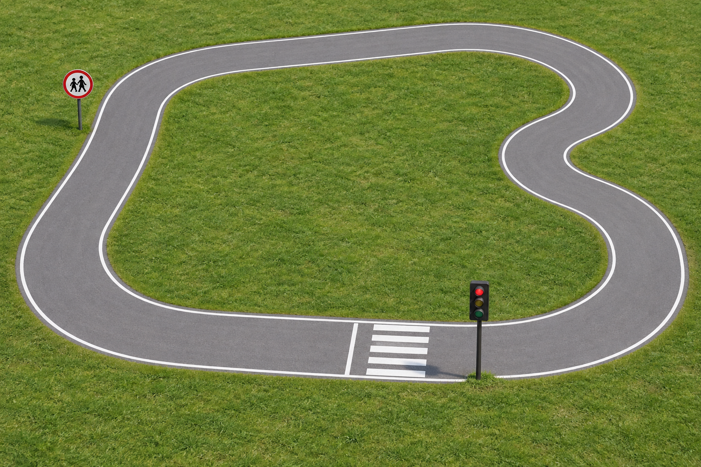

# Course Concept

`track-concept-v1.png` is an AI-generated visual concept approved during planning. It shows gray road with white borders, green surroundings, a zebra crossing, a traffic light, and a circular school-warning marker.

It is not a photograph of the original robot project, a calibrated simulation map, or evidence of working detection. Simulation geometry and local camera observations will be created separately.

Generated with the built-in OpenAI image-generation tool. The generation prompt is recorded in [generation-prompt.txt](generation-prompt.txt).
