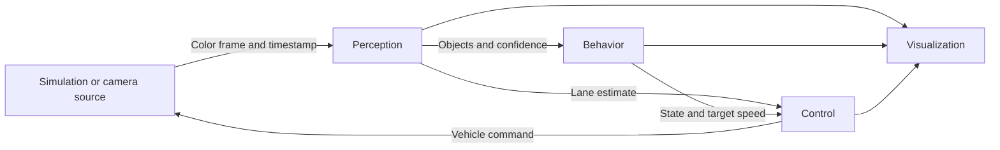

# Architecture and Development Stages

## Status

The first perception baseline, static synthetic image fixtures, diagnostic overlays, and tests are implemented. The independent steering PID is also implemented. Behavior, object recognition, and a dynamic vehicle simulator remain planned. Static fixture generation is not a closed-loop simulation.

The implemented `LaneResult` contract contains observed border pairs and centers, explicit validity, support coverage, and image-space error. See [perception details](perception.md). Coverage is not a calibrated confidence score.

## Data Flow

An application runner will coordinate the layers and load configuration. Shared data contracts will be introduced when the first runnable slice requires them.

## Planned Contracts

| Data | Producer | Consumers | Intended contents |
| --- | --- | --- | --- |
| Frame | Camera source / simulation | Perception, visualization | Color image, timestamp, frame identifier |
| Lane estimate | Perception | Control, visualization | Left/right boundaries, center estimate, error, confidence |
| Object observations | Perception | Behavior, visualization | Type or unknown, image location, signal/sign class, confidence |
| Driving intent | Behavior | Control, visualization | State, target speed, active stop/slow reasons |
| Vehicle command | Control | Simulation or future hardware adapter | Steering and speed command with documented units |

Missing detections must be explicit. Establish one coordinate convention, timestamp source, and error-sign convention before connecting modules. Behavior timers use the same clock as observations.

## Boundaries

- Perception sees camera observations, not the simulator's object list or true lane coordinates.
- Keep the color frame for traffic lights and signs; derive grayscale separately for white-line extraction.
- Behavior handles temporal decisions and restriction priority; control handles numeric steering and speed commands.
- Visualization is an observer. Detection input never includes its overlays.
- Ground truth is for evaluation only.

## Development Order

1. **Visual baseline:** extract the two white road boundaries from a simple local road image and save an overlay. Handle curves and crossing interference.
2. **Steering control:** define lane error, implement PID, and validate its response with controlled inputs.
3. **Closed-loop simulation:** update the vehicle from commands and generate the next camera view. Measure tracking behavior.
4. **Scene recognition:** add crossing, traffic-light, and simple sign detectors, including unknown states.
5. **Behavior integration:** add stopping, timed waiting, light handling, and school-zone slowing.
6. **Robustness and demonstration:** vary conditions, record results, and publish reproducible run instructions.

The first deliverable is a perception result, not an autonomous-driving claim. Update the root roadmap only after each stage has been implemented and checked.

## Implemented Control Contract

`SteeringPID.update_lane(lane, dt)` accepts the perception result through a structural interface. It returns normalized right-positive steering, a stop request, status, and individual PID terms. See [control details](control.md). A future adapter handles actuator units, speed, observation freshness, and stop enforcement.
